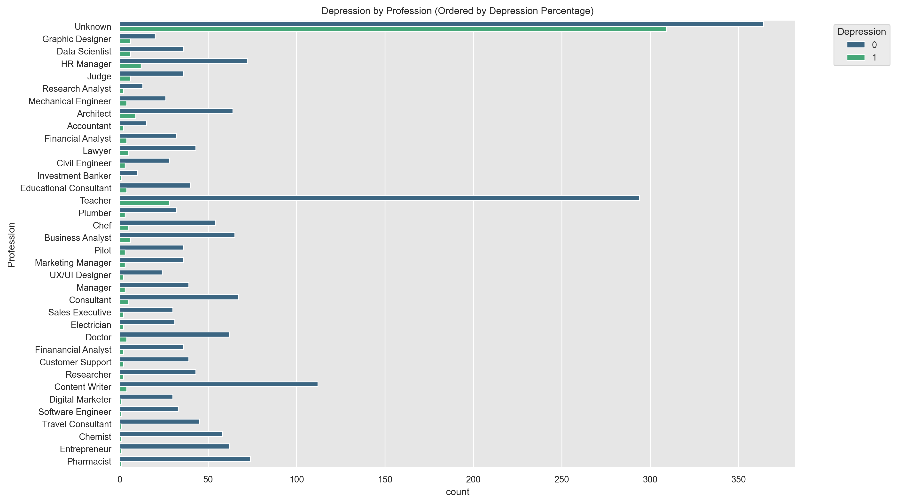
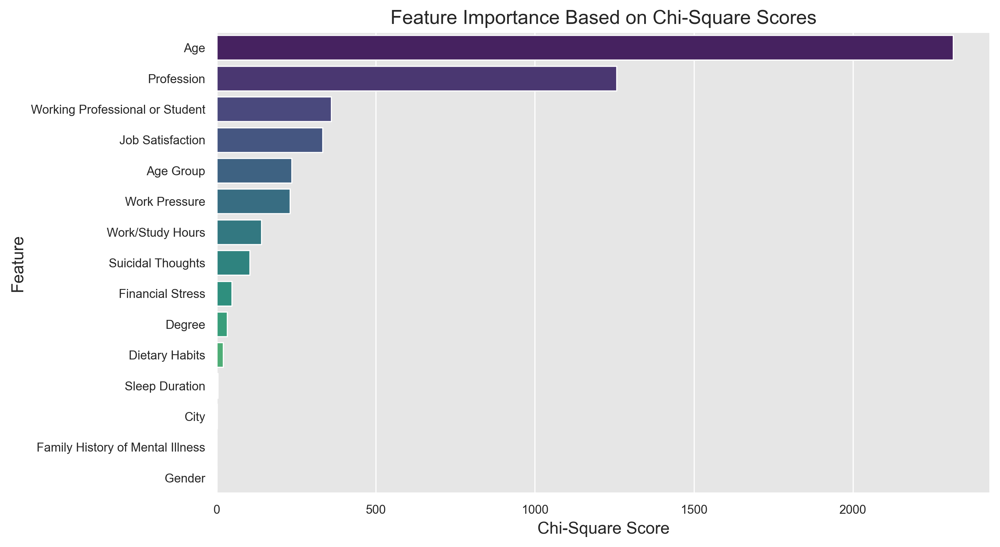
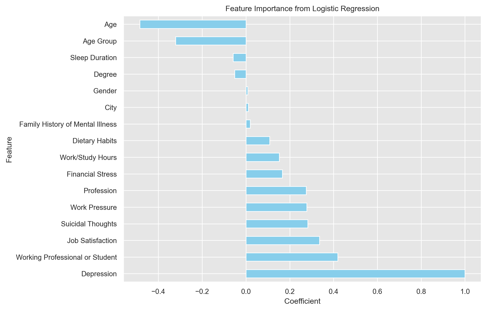

# Depression Analysis and Prediction

### 1\. Introduction

The primary objective of this project is to identify key factors contributing to depression and to build a predictive model based on these insights. By analyzing demographic information, work-related stressors, and lifestyle habits, this study uncovers influential patterns and leverages them to forecast the likelihood of depression.

-----

### 2\. Data Preparation

#### **Handling Missing Values**:

  - Numerical columns were imputed using the mean.
  - Categorical columns with missing values were replaced with the mode or a placeholder category ("Unknown").

#### **Feature Encoding**:

  - Categorical variables were encoded into numerical representations using one-hot encoding for nominal data and label encoding for ordinal data to prepare them for analysis and modeling.

-----

### 3\. Exploratory Data Analysis (EDA)

#### **Univariate Analysis**:

  - Histograms and boxplots revealed the distribution of numerical variables like **Age** and **Sleep Duration**.
    
  - Bar plots were used to visualize the frequency distribution of categorical variables such as **Profession** and **Work Pressure**.
    

#### **Bivariate Analysis**:

  - Correlations between numerical features and depression were visualized through heatmaps.
    

#### **Key Findings from EDA**:

  - **Work Pressure**, **Financial Stress**, and **Sleep Duration** showed notable relationships with depression.
  - Categorical features like **Profession** and **Degree** revealed disparities in depression rates across different groups.

-----

### 4\. Statistical Analysis

#### **Chi-Square Test**:

  - Identified significant associations between depression and categorical features such as **Age**, **Profession**, and **Working Professional or Student** status.
    
#### **Mutual Information Scores**:

  - Highlighted the dependency of depression on variables such as **Age** (highest score), **Work Pressure**, and **Profession**.
  - Features like **Gender** and **Family History of Mental Illness** showed surprisingly minimal statistical association in this dataset.
    
### 5\. Predictive Modeling

#### **Model Architecture and Pipeline**

The predictive pipeline consists of two primary stages:

1.  **Principal Component Analysis ($PCA$)**: Before classification, numerical features were transformed using $PCA$. The optimal number of components was found to be **15**.
2.  **Classifier**: A `LogisticRegression` model was used for classification (`solver='liblinear'`).

#### **Hyperparameter Tuning and Key Findings**

The `GridSearchCV` process identified an optimal regularization strength of **$C=0.1$**. This indicates that stronger regularization was crucial for preventing overfitting and improving the model's ability to generalize.

#### **Performance Evaluation**

The optimized pipeline achieved a **final cross-validation score of 0.87**. Assuming accuracy as the scoring metric, this means the model correctly predicts depression in approximately **87%** of cases.

#### **Model Performance Visualizations**

*Confusion Matrix showing the model's performance in classifying True Positives, True Negatives, False Positives, and False Negatives:*

*ROC Curve illustrating the trade-off between the true positive rate and false positive rate. The Area Under the Curve (AUC) summarizes the model's performance:*

-----

### 6\. Conclusion

This project successfully identified key psychosocial and lifestyle factors associated with depression and developed an accurate predictive model.

  - **Analytical Insights**: The analysis confirms that **age**, **high work pressure**, **low job satisfaction**, and **shorter sleep duration** are strongly linked to higher rates of depression.
  - **Modeling Success**: A machine learning pipeline using PCA and a regularized Logistic Regression model successfully predicted depression with **87% accuracy**.

By leveraging these insights, targeted strategies—such as age-specific programs and workplace mental health interventions—can be developed to address mental health challenges more effectively.

-----

### 7\. Future Work

While the current model demonstrates strong performance, the project could be taken further. The following steps will be considered for future iterations:

**1. Deeper Performance Evaluation:**

  * **Evaluate on a Hold-Out Test Set:** Assess the model on a completely separate test set.
  * **Analyze Class Imbalance:** Use metrics like **Precision**, **Recall**, and the **F1-Score**.

**2. Enhance Model Interpretability:**

  * **Analyze Feature Importance:** Train a model without $PCA$ to examine feature coefficients.
  * **Utilize SHAP or LIME:** Employ model-agnostic frameworks to explain individual predictions.

**3. Explore Alternative Models:**

  * **Test Non-Linear Models:** Experiment with algorithms like **Random Forest** or **XGBoost**.
  * **Compare with a Simpler Baseline:** Compare the pipeline's performance against a model without $PCA$ to prove its value.